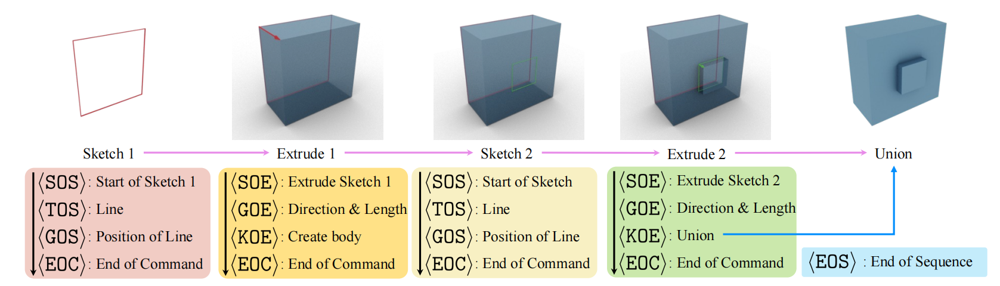

# Awesome Neural CAD

A curated list of awesome papers in Neural CAD.

## Reconstruction

| Preview | Title | Publication | Links |
|:---:|:---|:---:|:---:|
|  | Title of Paper 1: A Novel Approach | CVPR 2024 | [Paper](link) \| [Code](link) \| [Project](link) |
|  | Title of Paper 2: An Innovative Method | ICCV 2023 | [Paper](link) \| [Code](link) \| [Demo](link) |

## Generation

| Preview | Title | Publication | Links |
|:---:|:---|:---:|:---:|
|  | Title of Paper 1: A Novel Approach | CVPR 2024 | [Paper](link) \| [Code](link) \| [Project](link) |
|  | Title of Paper 2: An Innovative Method | ICCV 2023 | [Paper](link) \| [Code](link) \| [Demo](link) |

## Analysis

| Preview | Title | Publication | Links |
|:---:|:---|:---:|:---:|
|  | Title of Paper 1: A Novel Approach | CVPR 2024 | [Paper](link) \| [Code](link) \| [Project](link) |
|  | Title of Paper 2: An Innovative Method | ICCV 2023 | [Paper](link) \| [Code](link) \| [Demo](link) |

## Representation

| Preview | Title | Publication | Links |
|:---:|:---|:---:|:---:|
|  | Title of Paper 1: A Novel Approach | CVPR 2024 | [Paper](link) \| [Code](link) \| [Project](link) |
|  | Title of Paper 2: An Innovative Method | ICCV 2023 | [Paper](link) \| [Code](link) \| [Demo](link) |

<!-- ## Table of Contents
- [Latest Papers](#latest-papers)
- [Classic Papers](#classic-papers)
- [Contributing](#contributing) -->

<!-- ## Classic Papers

| Preview | Title | Publication | Links |
|:---:|:---|:---:|:---:|
|  | Title of Classic Paper 1 | SIGGRAPH 2019 | [Paper](link) \| [Project](link) |
|  | Title of Classic Paper 2 | NeurIPS 2018 | [Paper](link) \| [Code](link) | -->

<!-- ## Contributing
Please feel free to send me [pull requests](link) to add links.

### Guidelines for contributing:
- Paper must be published in top-tier venues
- Add a representative image (resolution: 300x200px recommended)
- Follow the format: 
  - Title: Complete paper title
  - Publication: Conference/Journal name and year
  - Links: Official paper/code/project links

### Venue List
- CVPR, ICCV, ECCV
- SIGGRAPH, SIGGRAPH Asia
- NeurIPS, ICLR, ICML
- TPAMI, IJCV, TOG

### License
MIT License -->
