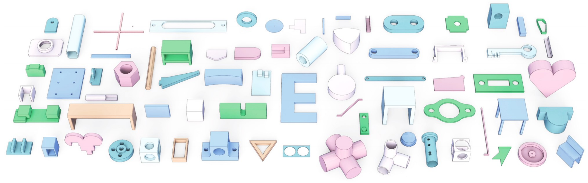
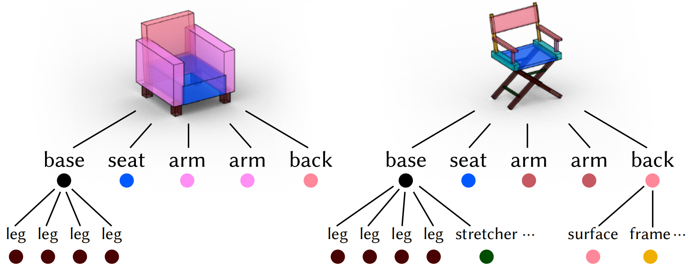

# Awesome Neural CAD 

The first curated list of Neural CAD papers that incorporates visual previews, making it easier to grasp key contributions at a glance.

## Generation

| Preview | Title | Publication | Links |
|:---:|:---|:---:|:---:|
|  | CAD-Recode: Reverse Engineering CAD Code from Point Clouds | CVPR 2024 | [Paper](link) \| [Code](link) \| [Project](link) |
|  | CAD-MLLM: Unifying Multimodality-Conditioned CAD Generation With MLLM | ICCV 2023 | [Paper](link) \| [Code](link) \| [Demo](link) |
|  | CAD-GPT: Synthesising CAD Construction Sequence with Spatial Reasoning-Enhanced Multimodal LLMs | ICCV 2023 | [Paper](link) \| [Code](link) \| [Demo](link) |
|  | CAD-GPT: Synthesising CAD Construction Sequence with Spatial Reasoning-Enhanced Multimodal LLMs | ICCV 2023 | [Paper](link) \| [Code](link) \| [Demo](link) |
|  | SkexGen: Autoregressive Generation of CAD Construction Sequences with Disentangled Codebooks | ICCV 2023 | [Paper](link) \| [Code](link) \| [Demo](link) |
|  | Hierarchical Neural Coding for Controllable CAD Model Generation | ICCV 2023 | [Paper](link) \| [Code](link) \| [Demo](link) |
|  | Text2CAD: Text to 3D CAD Generation via Technical Drawings | ICCV 2023 | [Paper](link) \| [Code](link) \| [Demo](link) |
|  | BrepGen: A B-rep Generative Diffusion Model with Structured Latent Geometry | ICCV 2023 | [Paper](link) \| [Code](link) \| [Demo](link) |
|  | SolidGen: An Autoregressive Model for Direct B-rep Synthesis | ICCV 2023 | [Paper](link) \| [Code](link) \| [Demo](link) |
|  | DeepCAD: A Deep Generative Network for Computer-Aided Design Models | ICCV 2023 | [Paper](link) \| [Code](link) \| [Demo](link) |
|  | DeepCAD: A Deep Generative Network for Computer-Aided Design Models | ICCV 2023 | [Paper](link) \| [Code](link) \| [Demo](link) |
|  | DeepCAD: A Deep Generative Network for Computer-Aided Design Models | ICCV 2023 | [Paper](link) \| [Code](link) \| [Demo](link) |
|  | DeepCAD: A Deep Generative Network for Computer-Aided Design Models | ICCV 2023 | [Paper](link) \| [Code](link) \| [Demo](link) |
|  | DeepCAD: A Deep Generative Network for Computer-Aided Design Models | ICCV 2023 | [Paper](link) \| [Code](link) \| [Demo](link) |
|  | DeepCAD: A Deep Generative Network for Computer-Aided Design Models | ICCV 2023 | [Paper](link) \| [Code](link) \| [Demo](link) |
|  | DeepCAD: A Deep Generative Network for Computer-Aided Design Models | ICCV 2023 | [Paper](link) \| [Code](link) \| [Demo](link) |
<!-- |  | CAD-GPT: Synthesising CAD Construction Sequence with Spatial Reasoning-Enhanced Multimodal LLMs | ICCV 2023 | [Paper](link) \| [Code](link) \| [Demo](link) | -->

## Reconstruction

| Preview | Title | Publication | Links |
|:---:|:---|:---:|:---:|
|  | BSP-Net: Generating Compact Meshes via Binary Space Partitioning | CVPR 2024 | [Paper](link) \| [Code](link) \| [Project](link) |
|  | CAPRI-Net: Learning Compact CAD Shapes with Adaptive Primitive Assembly | ICCV 2023 | [Paper](link) \| [Code](link) \| [Demo](link) |
|  | CAPRI-Net: Learning Compact CAD Shapes with Adaptive Primitive Assembly | ICCV 2023 | [Paper](link) \| [Code](link) \| [Demo](link) |
|  | CSGNet: Neural Shape Parser for Constructive Solid Geometry | CVPR 2018 | [Paper](link) \| [Code](link) \| [Demo](link) |
|  | CSG-Stump: A Learning Friendly CSG-Like Representation for Interpretable Shape Parsing | ICCV 2021 | [Paper](link) \| [Code](link) \| [Demo](link) |
|  | CSGNet: Neural Shape Parser for Constructive Solid Geometry | CVPR 2018 | [Paper](link) \| [Code](link) \| [Demo](link) |
|  | CSGNet: Neural Shape Parser for Constructive Solid Geometry | CVPR 2018 | [Paper](link) \| [Code](link) \| [Demo](link) |
|  | CSGNet: Neural Shape Parser for Constructive Solid Geometry | CVPR 2018 | [Paper](link) \| [Code](link) \| [Demo](link) |
|  | CSGNet: Neural Shape Parser for Constructive Solid Geometry | CVPR 2018 | [Paper](link) \| [Code](link) \| [Demo](link) |
|  | CSGNet: Neural Shape Parser for Constructive Solid Geometry | CVPR 2018 | [Paper](link) \| [Code](link) \| [Demo](link) |
|  | CSGNet: Neural Shape Parser for Constructive Solid Geometry | CVPR 2018 | [Paper](link) \| [Code](link) \| [Demo](link) |
|  | CSGNet: Neural Shape Parser for Constructive Solid Geometry | CVPR 2018 | [Paper](link) \| [Code](link) \| [Demo](link) |
|  | CSGNet: Neural Shape Parser for Constructive Solid Geometry | CVPR 2018 | [Paper](link) \| [Code](link) \| [Demo](link) |
|  | CSGNet: Neural Shape Parser for Constructive Solid Geometry | CVPR 2018 | [Paper](link) \| [Code](link) \| [Demo](link) |
|  | CSGNet: Neural Shape Parser for Constructive Solid Geometry | CVPR 2018 | [Paper](link) \| [Code](link) \| [Demo](link) |
|  | CSGNet: Neural Shape Parser for Constructive Solid Geometry | CVPR 2018 | [Paper](link) \| [Code](link) \| [Demo](link) |
|  | CSGNet: Neural Shape Parser for Constructive Solid Geometry | CVPR 2018 | [Paper](link) \| [Code](link) \| [Demo](link) |
|  | CSGNet: Neural Shape Parser for Constructive Solid Geometry | CVPR 2018 | [Paper](link) \| [Code](link) \| [Demo](link) |
|  | CSGNet: Neural Shape Parser for Constructive Solid Geometry | CVPR 2018 | [Paper](link) \| [Code](link) \| [Demo](link) |
|  | CSGNet: Neural Shape Parser for Constructive Solid Geometry | CVPR 2018 | [Paper](link) \| [Code](link) \| [Demo](link) |
|  | CSGNet: Neural Shape Parser for Constructive Solid Geometry | CVPR 2018 | [Paper](link) \| [Code](link) \| [Demo](link) |
|  | CSGNet: Neural Shape Parser for Constructive Solid Geometry | CVPR 2018 | [Paper](link) \| [Code](link) \| [Demo](link) |
<!-- |  | CSGNet: Neural Shape Parser for Constructive Solid Geometry | CVPR 2018 | [Paper](link) \| [Code](link) \| [Demo](link) | -->

<!-- ## Representation

| Preview | Title | Publication | Links |
|:---:|:---|:---:|:---:|
|  | Title of Paper 1: A Novel Approach | CVPR 2024 | [Paper](link) \| [Code](link) \| [Project](link) |
|  | Title of Paper 2: An Innovative Method | ICCV 2023 | [Paper](link) \| [Code](link) \| [Demo](link) | -->

## Analysis

| Preview | Title | Publication | Links |
|:---:|:---|:---:|:---:|
|  | Title of Paper 1: A Novel Approach | CVPR 2024 | [Paper](link) \| [Code](link) \| [Project](link) |
|  | Title of Paper 2: An Innovative Method | ICCV 2023 | [Paper](link) \| [Code](link) \| [Demo](link) |

<!-- ## Abstraction

| Preview | Title | Publication | Links |
|:---:|:---|:---:|:---:|
|  | Title of Paper 1: A Novel Approach | CVPR 2024 | [Paper](link) \| [Code](link) \| [Project](link) |
|  | Title of Paper 2: An Innovative Method | ICCV 2023 | [Paper](link) \| [Code](link) \| [Demo](link) | -->

## Others

| Preview | Title | Publication | Links |
|:---:|:---|:---:|:---:|
|  | Title of Paper 1: A Novel Approach | CVPR 2024 | [Paper](link) \| [Code](link) \| [Project](link) |
|  | Title of Paper 2: An Innovative Method | ICCV 2023 | [Paper](link) \| [Code](link) \| [Demo](link) |
