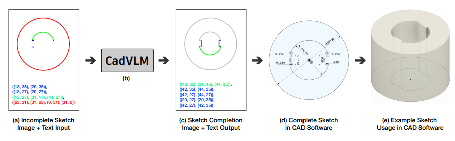

<meta name="google-site-verification" content="tqrUKB0nU6GrEyWS1wJV32TrWGZmF3-OfhZ1mCGXy0E" />
<head>
<meta name="google-site-verification" content="tqrUKB0nU6GrEyWS1wJV32TrWGZmF3-OfhZ1mCGXy0E" />
</head>

# Awesome Neural CAD 

> 🎯 The ***first*** awesome list featuring visual paper previews - see research at a glance.

> 📚 We have also included a selection of papers that, while not strictly falling within the CAD domain, demonstrate relevant techniques and methodologies that could benefit CAD research and applications.

> 🏠 You can also check our [Project Homepage](https://bunnysocrazy.github.io/Awesome-Neural-CAD/).
## Generation

| Preview | Title | Publication | Links |
|:---:|:---|:---:|:---:|
|  | CAD-GPT: Synthesising CAD Construction Sequence with Spatial Reasoning-Enhanced Multimodal LLMs | arXiv 2025 | [Paper](https://arxiv.org/abs/2412.19663)   [Project](https://openiwin.github.io/CAD-GPT/) |
|  | Revisiting CAD Model Generation by Learning Raster Sketch | AAAI   2025 | [Paper](https://www.arxiv.org/abs/2503.00928) |
|  | FlexCAD: Unified and Versatile Controllable CAD Generation with Fine-tuned Large Language Models | ICLR 2025 | [Paper](https://arxiv.org/abs/2411.05823) |
|  | Don’t Mesh with Me: Generating Constructive Solid Geometry Instead of Meshes by Fine-Tuning a Code-Generation LLM | arXiv 2024 | [Paper](https://arxiv.org/abs/2411.15279) |
|  | CAD-MLLM: Unifying Multimodality-Conditioned CAD Generation With MLLM | arXiv 2024 | [Paper](https://arxiv.org/abs/2411.04954)   [Project](https://cad-mllm.github.io/) |
|  | Text2CAD: Text to 3D CAD Generation via Technical Drawings | NeurIPS 2024 | [Paper](https://arxiv.org/abs/2411.06206)   [Code](https://github.com/SadilKhan/Text2CAD)   [Project](https://sadilkhan.github.io/text2cad-project/) |
|  | CadVLM: Bridging Language and Vision in the Generation of Parametric CAD Sketches | ECCV 2024 | [Paper](https://arxiv.org/abs/2409.17457)|
|  | BrepGen: A B-rep Generative Diffusion Model with Structured Latent Geometry | SIGGRAPH 2024 | [Paper](https://arxiv.org/abs/2401.15563)   [Code](https://github.com/samxuxiang/BrepGen) |
|  | Learn to Create Simple LEGO Micro Buildings | SIGGRAPH Asia 2024 | [Paper](https://dlnext.acm.org/doi/pdf/10.1145/3687755)   [Code](https://github.com/Occulte/LEGO_Buildings_Generation) |
|  | Generating 3D House Wireframes with Semantics | ECCV 2024 | [Paper](https://arxiv.org/abs/2407.12267)   [Project](https://vcc.tech/research/2024/3DWire) |
|  | SolidGen: An Autoregressive Model for Direct B-rep Synthesis | ICLR 2024 | [Paper](https://openreview.net/pdf?id=ZR2CDgADRo) |
|  | VQ-CAD: Computer-Aided Design model generation with vector quantized diffusion | CAGD 2024 | [Paper](https://www.sciencedirect.com/science/article/pii/S016783962400061X) |
|  | SketchGen: Generating Constrained CAD Sketches | ICCV 2023 | [Paper](https://proceedings.neurips.cc/paper_files/paper/2021/file/28891cb4ab421830acc36b1f5fd6c91e-Paper.pdf)   [Code](https://github.com/wamiq-reyaz/sketchgen) |
|  | Hierarchical Neural Coding for Controllable CAD Model Generation | ICML 2023 | [Paper](https://arxiv.org/abs/2307.00149)   [Code](https://github.com/samxuxiang/hnc-cad)   [Project](https://hnc-cad.github.io/) |
|  | SkexGen: Autoregressive Generation of CAD Construction Sequences with Disentangled Codebooks | ICML 2022 | [Paper](https://arxiv.org/abs/2207.04632)   [Code](https://github.com/samxuxiang/SkexGen)   [Project](https://samxuxiang.github.io/skexgen) |
|  | Discovering Design Concepts for CAD Sketches | NeurIPS 2022 | [Paper](https://arxiv.org/abs/2210.14451)   [Code](https://github.com/yyuezhi/SketchConcept)|
|  | CAD2Sketch: Generating Concept Sketches from CAD Sequences | SIGGRAPH Asia 2022 | [Paper](https://repo-sam.inria.fr/d3/cad2sketch/cad2sketch_paper.pdf)   [Code](https://gitlab.inria.fr/D3/cad2sketch)   [Project](https://ns.inria.fr/d3/cad2sketch/) |
|  | Free2CAD: Parsing Freehand Drawings into CAD Commands | SIGGRAPH 2022 | [Code](https://github.com/Enigma-li/Free2CAD)   [Project](https://geometry.cs.ucl.ac.uk/projects/2022/free2cad/) |
|  | DeepCAD: A Deep Generative Network for Computer-Aided Design Models | ICCV 2021| [Paper](https://arxiv.org/abs/2105.09492)   [Code](https://github.com/ChrisWu1997/DeepCAD)   [Project](http://www.cs.columbia.edu/cg/deepcad/) |
|  | Engineering Sketch Generation for Computer-Aided Design | CVPR 2021 workshop | [Paper](https://openaccess.thecvf.com/content/CVPR2021W/SketchDL/papers/Willis_Engineering_Sketch_Generation_for_Computer-Aided_Design_CVPRW_2021_paper.pdf) |
|  | Engineering Sketch Generation for Computer-Aided Design | CVPR 2021 | [Paper](https://arxiv.org/abs/2012.09340)    [Code](https://github.com/yi-ming-qian/roofgan) |
|  | Computer-aided design as language | NeurIPS 2021 | [Paper](https://arxiv.org/pdf/2105.02769)|
|  | DeepSVG: A Hierarchical Generative Network for Vector Graphics Animation | NeurIPS 2020 | [Paper](https://arxiv.org/abs/2007.11301)   [Code](https://github.com/alexandre01/deepsvg)   [Project](https://alexandre01.github.io/deepsvg/) |
|  | SDM-NET: Deep Generative Network for Structured Deformable Mesh | TOG 2019 | [Paper](https://dl.acm.org/doi/pdf/10.1145/3355089.3356488)   [Code](https://github.com/gaolinorange/SDMNET_stamp) |
|  | StructureNet: Hierarchical Graph Networks for 3D Shape Generation | Siggraph Asia 2019 | [Paper](https://arxiv.org/abs/1908.00575)   [Code](https://github.com/daerduoCarey/structurenet)   [Project](https://cs.stanford.edu/~kaichun/structurenet/) |
|  | AtlasNet: A Papier-Mâché Approach to Learning 3D Surface Generation | CVPR 2018 | [Paper](https://arxiv.org/abs/1802.05384)   [Code](https://github.com/ThibaultGROUEIX/AtlasNet)   [Project](https://imagine.enpc.fr/~groueixt/atlasnet/) |

## Reconstruction

| Preview | Title | Publication | Links |
|:---:|:---|:---:|:---:|
|  | BGPSeg: Boundary-Guided Primitive Instance Segmentation of Point Clouds | TIP 2025 | [Paper](https://ieeexplore.ieee.org/abstract/document/10896454) |
|  | CAD-Recode: Reverse Engineering CAD Code from Point Clouds | arXiv 2024 | [Paper](https://arxiv.org/pdf/2412.14042)   [Code](https://github.com/filaPro/cad-recode) |
|  | Img2CAD: Conditioned 3D CAD Model Generation from Single Image with Structured Visual Geometry | arXiv 2024 | [Paper](https://arxiv.org/pdf/2410.03417) |
|  | PS-CAD: Local Geometry Guidance via Prompting and Selection for CAD Reconstruction | arXiv 2024 | [Paper](https://arxiv.org/pdf/2405.15188) |
|  | Img2CAD: Reverse Engineering 3D CAD Models from Images through VLM-Assisted Conditional Factorization | arXiv 2024 | [Paper](https://arxiv.org/abs/2408.01437)    [Project](https://anonymous123342.github.io/) |
|  | Draw Step by Step: Reconstructing CAD Construction Sequences from Point Clouds via Multimodal Diffusion | CVPR 2024 | [Paper](http://openaccess.thecvf.com/content/CVPR2024/papers/Ma_Draw_Step_by_Step_Reconstructing_CAD_Construction_Sequences_from_Point_CVPR_2024_paper.pdf) |
|  | CAD-SIGNet: CAD Language Inference from Point Clouds using Layer-wise Sketch Instance Guided Attention | CVPR 2024 | [Paper](https://openaccess.thecvf.com/content/CVPR2024/papers/Khan_CAD-SIGNet_CAD_Language_Inference_from_Point_Clouds_using_Layer-wise_Sketch_CVPR_2024_paper.pdf) |
|  | Point2CAD: Reverse Engineering CAD Models from 3D Point Clouds | CVPR 2024 | [Paper](https://openaccess.thecvf.com/content/CVPR2024/papers/Liu_Point2CAD_Reverse_Engineering_CAD_Models_from_3D_Point_Clouds_CVPR_2024_paper.pdf)   [Code](https://github.com/prs-eth/point2cad)   [Project](https://www.obukhov.ai/point2cad.html) |
|  | DPA-Net: Structured 3D Abstraction from Sparse Views via Differentiable Primitive Assembly | ECCV 2024 | [Paper](https://arxiv.org/abs/2404.00875)|
|  | Differentiable Convex Polyhedra Optimization from Multi-view Images | ECCV 2024 | [Paper](https://arxiv.org/pdf/2407.15686)   [Code](https://github.com/kimren227/DiffConvex) |
|  | PolyGNN: Polyhedron-based Graph Neural Network for 3D Building Reconstruction from Point Clouds | ISPRS 2024 | [Paper](https://www.sciencedirect.com/science/article/pii/S0924271624003691)   [Code](https://github.com/chenzhaiyu/polygnn) |
|  | Split-and-Fit: Learning B-Reps via Structure-Aware Voronoi Partitioning | SIGGRAPH 2024 | [Paper](https://arxiv.org/pdf/2406.05261)   [Code](https://github.com/yilinliu77/NVDNet) |
|  | D2CSG: Unsupervised Learning of Compact CSG Trees with Dual Complements and Dropouts | Neurips 2024 | [Paper](https://openreview.net/pdf?id=tQYGjnxPOm)   [Code](https://github.com/FENGGENYU/D2CSG)|
|  | SECAD-Net: Self-Supervised CAD Reconstruction by Learning Sketch-Extrude Operations | CVPR 2023 | [Paper](https://openaccess.thecvf.com/content/CVPR2023/papers/Li_SECAD-Net_Self-Supervised_CAD_Reconstruction_by_Learning_Sketch-Extrude_Operations_CVPR_2023_paper.pdf)   [Code](https://github.com/BunnySoCrazy/SECAD-Net)|
|  | PlankAssembly: Robust 3D Reconstruction from Three Orthographic Views with Learnt Shape Programs | ICCV 2023 | [Paper](https://arxiv.org/abs/2308.05744)   [Code](https://github.com/manycore-research/PlankAssembly/)   [Project](https://manycore-research.github.io/PlankAssembly/) |
|  | Surface and Edge Detection for Primitive Fitting of Point Clouds | SIGGRAPH 2023 | [Code](https://github.com/yuanqili78/SED-Net) |
|  | BPNet: Bézier Primitive Segmentation on 3D Point Clouds | IJCAI 2023 | [Paper](https://arxiv.org/pdf/2307.04013)   [Code](https://github.com/bizerfr/BPNet) |
|  | Vitruvion: A Generative Model of Parametric CAD Sketches | ICLR 2022 | [Paper](https://arxiv.org/pdf/2109.14124)   [Code](https://github.com/PrincetonLIPS/vitruvion) |
|  | Reconstructing compact building models from point clouds using deep implicit fields | ISPRS 2022 | [Paper](https://www.sciencedirect.com/science/article/pii/S0924271622002611)   [Code](https://github.com/chenzhaiyu/points2poly) |
|  | CADOps-Net: Jointly Learning CAD Operation Types and Steps from Boundary-Representations | 3DV 2022 | [Paper](https://arxiv.org/abs/2208.10555)|
|  | Point2Cyl: Reverse Engineering 3D Objects from Point Clouds to Extrusion Cylinders | CVPR 2022 | [Paper](https://arxiv.org/abs/2112.09329)   [Code](https://github.com/mikacuy/point2cyl)   [Project](https://point2cyl.github.io/) |
|  | ExtrudeNet: Unsupervised Inverse Sketch-and-Extrude for Shape Parsing | ECCV 2022 | [Paper](https://arxiv.org/pdf/2209.15632)   [Code](https://github.com/kimren227/ExtrudeNet)   [Project](https://kimren227.github.io/projects/ExtrudeNet/) |
|  | Reconstructing editable prismatic CAD from rounded voxel models | SIGGRAPH Asia 2022 | [Paper](https://arxiv.org/abs/2209.01161) |
|  | ComplexGen: CAD Reconstruction by B-Rep Chain Complex Generation | SIGGRAPH 2022 | [Paper](https://arxiv.org/abs/2205.14573)   [Code](https://github.com/guohaoxiang/ComplexGen)   [Project](https://haopan.github.io/complexgen.html) |
|  | CAPRI-Net: Learning Compact CAD Shapes with Adaptive Primitive Assembly | CVPR 2022 | [Paper](https://arxiv.org/abs/2104.05652)   [Code](https://github.com/FENGGENYU/CAPRI-Net)   [Project](https://fenggenyu.github.io/capri.html) |
|  | LC2WF:Learning to Construct 3D Building Wireframes from 3D Line Clouds | BMVC 2022 | [Paper](https://arxiv.org/abs/2208.11948)   [Code](https://github.com/Luo1Cheng/LC2WF)|
|  | HPNet: Deep Primitive Segmentation Using Hybrid Representations | ICCV 2021 | [Paper](http://openaccess.thecvf.com/content/ICCV2021/papers/Yan_HPNet_Deep_Primitive_Segmentation_Using_Hybrid_Representations_ICCV_2021_paper.pdf)   [Code](https://github.com/SimingYan/HPNet) |
|  | CPFN: Cascaded Primitive Fitting Networks for High-Resolution Point Clouds | ICCV 2021 | [Paper](https://openaccess.thecvf.com/content/ICCV2021/papers/Le_CPFN_Cascaded_Primitive_Fitting_Networks_for_High-Resolution_Point_Clouds_ICCV_2021_paper.pdf)   [Code](https://github.com/erictuanle/CPFN) |
|  | CSG-Stump: A Learning Friendly CSG-Like Representation for Interpretable Shape Parsing | ICCV 2021 | [Paper](https://arxiv.org/abs/2108.11305)   [Code](https://github.com/kimren227/CSGStumpNet)   [Project](https://kimren227.github.io/projects/CSGStump/) |
|  | PC2WF: 3D Wireframe Reconstruction from Raw Point Clouds | ICLR 2021 | [Paper](https://arxiv.org/pdf/2103.02766)   [Code](https://github.com/YujiaLiu76/PC2WF) |
|  |Intuitive and Efficient Roof Modeling for Reconstruction and Synthesis | SIGGRAPH Asia 2021 | [Paper](https://arxiv.org/abs/2109.07683)   [Code](https://github.com/llorz/SGA21_roofOptimization)|
|  |Sketch2CAD: Sequential CAD Modeling by Sketching in Context | SIGGRAPH Asia 2020 | [Paper](https://enigma-li.github.io/projects/sketch2cad/Sketch2CAD_SIGA_2020.pdf)   [Code](https://github.com/Enigma-li/Sketch2CAD)   [Project](https://geometry.cs.ucl.ac.uk/projects/2020/sketch2cad/) |
|  | CvxNet: Learnable Convex Decomposition | CVPR 2020 | [Paper](https://openaccess.thecvf.com/content_CVPR_2020/papers/Deng_CvxNet_Learnable_Convex_Decomposition_CVPR_2020_paper.pdf)   [Code](https://github.com/tensorflow/graphics/tree/master/tensorflow_graphics/projects/cvxnet)   [Project](https://cvxnet.github.io/) |
|  | BSP-Net: Generating Compact Meshes via Binary Space Partitioning | CVPR 2020 oral | [Paper](https://arxiv.org/pdf/1911.06971.pdf)   [Code](https://github.com/czq142857/BSP-NET-pytorch)   [Project](https://bsp-net.github.io/) |
|  | PIE-NET: Parametric Inference of Point Cloud Edges | Neurips 2020 | [Paper](https://arxiv.org/abs/2007.04883)   [Code](https://github.com/wangxiaogang866/PIE-NET)|
|  | UCSG-Net -- Unsupervised Discovering of Constructive Solid Geometry Tree | Neurips 2020 | [Paper](https://arxiv.org/abs/2006.09102)   [Code](https://github.com/kacperkan/ucsgnet)   [Project](https://kacperkan.github.io/ucsgnet/) |
|  | ParSeNet: A Parametric Surface Fitting Network for 3D Point Clouds | ECCV 2020 | [Paper](https://arxiv.org/pdf/2003.12181)   [Code](https://github.com/Hippogriff/parsenet-codebase)   [Project](https://hippogriff.github.io/parsenet/) |
|  | Supervised Fitting of Geometric Primitives to 3D Point Clouds | CVPR 2019 oral | [Paper](https://arxiv.org/abs/1811.08988)   [Code](https://github.com/lingxiaoli94/SPFN) |
|  | CSGNet: Neural Shape Parser for Constructive Solid Geometry | CVPR 2018 | [Paper](https://arxiv.org/abs/1712.08290)   [Code](https://github.com/Hippogriff/CSGNet) |

## Abstraction

| Preview | Title | Publication | Links |
|:---:|:---|:---:|:---:|
|  | ShapeLib: Designing a library of procedural 3D shape abstractions with Large Language Models | arxiv 2025 | [Paper](https://arxiv.org/abs/2502.08884)|
|  | Improving Unsupervised Visual Program Inference with Code Rewriting Families | ICCV 2023 (oral) | [Paper](https://arxiv.org/abs/2309.14972)   [Code](https://github.com/bardofcodes/coref/)   [Project](https://bardofcodes.github.io/coref/) |
|  | SweepNet: Unsupervised Learning Shape Abstraction via Neural Sweepers | ECCV 2024 | [Paper](https://arxiv.org/pdf/2407.06305)   [Code](https://github.com/mingrui-zhao/SweepNet/tree/code)   [Project](https://mingrui-zhao.github.io/SweepNet/) |
|  | ShapeMOD: Macro Operation Discovery for 3D Shape Programs | SIGGRAPH 2021 | [Paper](https://rkjones4.github.io/pdf/shapeMOD.pdf)   [Code](https://github.com/rkjones4/shapeMOD)   [Project](https://rkjones4.github.io/shapeMOD.html) |
|  | Learning Unsupervised Hierarchical Part Decomposition of 3D Objects from a Single RGB Image | CVPR 2020 | [Paper](https://openaccess.thecvf.com/content_CVPR_2020/papers/Paschalidou_Learning_Unsupervised_Hierarchical_Part_Decomposition_of_3D_Objects_From_a_CVPR_2020_paper.pdf)   [Code](https://github.com/paschalidoud/hierarchical_primitives) |
|  | ShapeAssembly: Learning to Generate Programs for 3D Shape Structure Synthesis | SIGGRAPH Asia 2020 | [Paper](https://rkjones4.github.io/pdf/shapeAssembly.pdf)   [Code](https://github.com/rkjones4/shapeAssembly)   [Project](https://rkjones4.github.io/shapeAssembly.html) |
|  | Superquadrics Revisited: Learning 3D Shape Parsing beyond Cuboids | CVPR 2019 | [Paper](https://arxiv.org/abs/1904.09970)   [Code](https://github.com/paschalidoud/superquadric_parsing)   [Project](https://superquadrics.com/learnable-superquadrics.html) |
|  | Im2Struct: Recovering 3D Shape Structure from a Single RGB Image | CVPR 2018 | [Paper](https://openaccess.thecvf.com/content_cvpr_2018/papers/Niu_Im2Struct_Recovering_3D_CVPR_2018_paper.pdf)   [Code](https://github.com/chengjieniu/Im2Struct) |
|  | Learning Shape Abstractions by Assembling Volumetric Primitives | CVPR 2017 | [Paper](https://openaccess.thecvf.com/content_cvpr_2017/papers/Tulsiani_Learning_Shape_Abstractions_CVPR_2017_paper.pdf)   [Code](https://github.com/shubhtuls/volumetricPrimitives)   [Project](https://shubhtuls.github.io/volumetricPrimitives/) |

## Analysis

| Preview | Title | Publication | Links |
|:---:|:---|:---:|:---:|
|  | CADTalk: An Algorithm and Benchmark for Semantic Commenting of CAD Programs | CVPR 2024 | [Paper](https://arxiv.org/abs/2311.16703)   [Code](https://github.com/YYYYYHC/CADTalk)    [Project](https://enigma-li.github.io/CADTalk/) |
|  | GAT-CADNet: Graph Attention Network for Panoptic Symbol Spotting in CAD Drawings | CVPR 2022 | [Paper](https://openaccess.thecvf.com/content/CVPR2022/papers/Zheng_GAT-CADNet_Graph_Attention_Network_for_Panoptic_Symbol_Spotting_in_CAD_CVPR_2022_paper.pdf)   [Code](https://github.com/Liberation-happy/GAT-CADNet) |
|  | UV-Net: Learning from Boundary Representations | CVPR 2021 | [Paper](https://arxiv.org/abs/2006.10211)   [Code](https://github.com/AutodeskAILab/UV-Net) |
|  | BRepNet: A Topological Message Passing System for Solid Models | CVPR 2021 | [Paper](https://arxiv.org/abs/2104.00706)   [Code](https://github.com/AutodeskAILab/BRepNet) |

## Others

| Preview | Title | Publication | Links |
|:---:|:---|:---:|:---:|
|  | CAD-Editor: Text-based CAD Editing through Adapting Large Language Models with Synthetic Data | arXiv 2025 | [Paper](https://arxiv.org/abs/2502.03997) |
|  | JoinABLe: Learning Bottom-up Assembly of Parametric CAD Joints | CVPR 2022 | [Paper](https://arxiv.org/abs/2111.12772)   [Code](https://github.com/AutodeskAILab/JoinABLe) |

## Dataset

| Preview | Title | Publication | Links |
|:---:|:---|:---:|:---:|
|  | Fusion 360 Gallery: A Dataset and Environment for Programmatic CAD Construction from Human Design Sequences (Assembly Dataset) | CVPR 2022 | [Paper](https://arxiv.org/abs/2111.12772)   [Code](https://github.com/AutodeskAILab/JoinABLe)   [Project](https://github.com/AutodeskAILab/Fusion360GalleryDataset) |
|  | Fusion 360 Gallery: A Dataset and Environment for Programmatic CAD Construction from Human Design Sequences (Reconstruction Dataset) | SIGGRAPH 2021 | [Paper]([[https://arxiv.org/abs/2105.09492](https://arxiv.org/abs/2010.02392))   [Project](https://github.com/AutodeskAILab/Fusion360GalleryDataset) |
|  | Fusion 360 Gallery: A Dataset and Environment for Programmatic CAD Construction from Human Design Sequences (Segmentation Dataset) | CVPR 2021 | [Paper](https://arxiv.org/abs/2104.00706)   [Project](https://github.com/AutodeskAILab/Fusion360GalleryDataset) |
|  | DeepCAD: A Deep Generative Network for Computer-Aided Design Models | ICCV 2021 | [Paper](https://arxiv.org/abs/2105.09492)   [Code](https://github.com/ChrisWu1997/DeepCAD)   [Project](http://www.cs.columbia.edu/cg/deepcad/) |
|  | ABC: A Big CAD Model Dataset For Geometric Deep Learning | CVPR 2019 | [Paper](https://arxiv.org/abs/2105.09492)   [Project](https://deep-geometry.github.io/abc-dataset/) |

