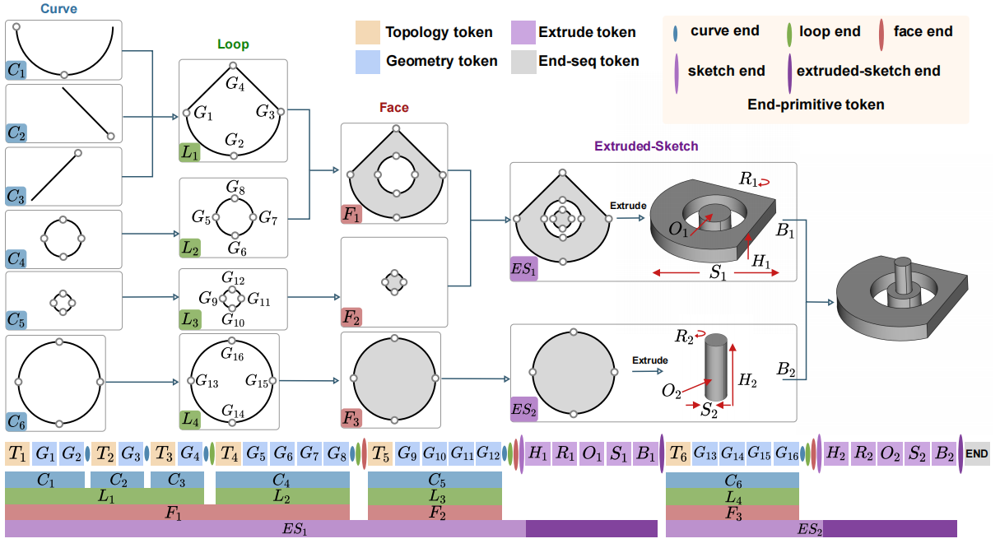
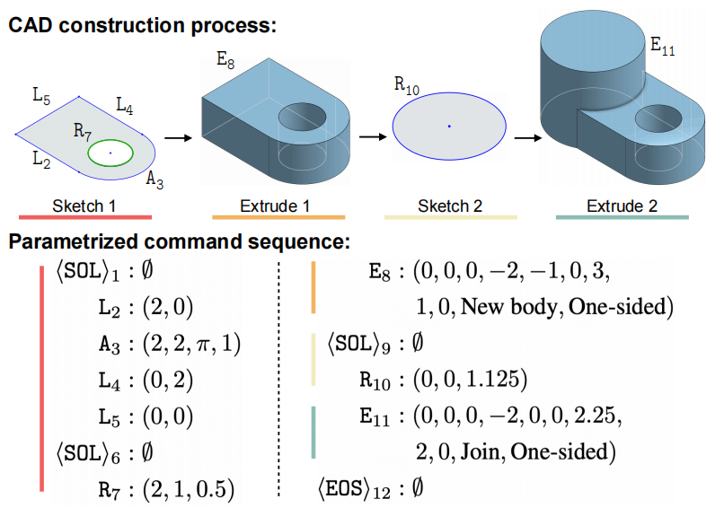
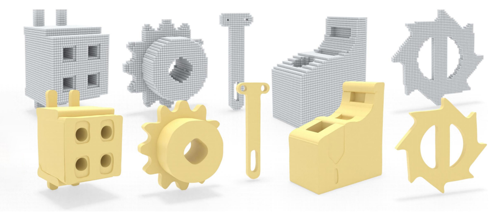

# Awesome Neural CAD 

> 🎯 The first curated list of Neural CAD papers that incorporates visual previews, making it easier to grasp key contributions at a glance. 

> 📚 I have also included selected papers that, while not strictly falling within the CAD domain, Projectnstrate relevant techniques and methodologies that could benefit CAD research and applications.

## Generation

| Preview | Title | Publication | Links |
|:---:|:---|:---:|:---:|
|  | CAD-GPT: Synthesising CAD Construction Sequence with Spatial Reasoning-Enhanced Multimodal LLMs | arXiv 2025 | [Paper](https://arxiv.org/abs/2412.19663)   [Project](https://openiwin.github.io/CAD-GPT/) |
|  | FlexCAD: Unified and Versatile Controllable CAD Generation with Fine-tuned Large Language Models | ICLR 2025 | [Paper](https://arxiv.org/abs/2411.05823) |
|  | SkexGen: Autoregressive Generation of CAD Construction Sequences with Disentangled Codebooks | ICML 2022 | [Paper](https://arxiv.org/abs/2207.04632)   [Code](https://github.com/samxuxiang/SkexGen)   [Project](https://samxuxiang.github.io/skexgen) |
|  | CAD-MLLM: Unifying Multimodality-Conditioned CAD Generation With MLLM | arXiv 2024 | [Paper](https://arxiv.org/abs/2411.04954)   [Project](https://cad-mllm.github.io/) |
|  | Text2CAD: Text to 3D CAD Generation via Technical Drawings | NeurIPS 2024 | [Paper](https://arxiv.org/abs/2411.06206)   [Code](https://github.com/SadilKhan/Text2CAD)   [Project](https://sadilkhan.github.io/text2cad-project/) |
|  | BrepGen: A B-rep Generative Diffusion Model with Structured Latent Geometry | SIGGRAPH 2024 | [Paper](https://arxiv.org/abs/2401.15563)   [Code](https://github.com/samxuxiang/BrepGen) |
|  | SolidGen: An Autoregressive Model for Direct B-rep Synthesis | ICLR 2024 | [Paper](https://openreview.net/pdf?id=ZR2CDgADRo) |
|  | SketchGen: Generating Constrained CAD Sketches | ICCV 2023 | [Paper](link)   [Code](link)   [Project](link) |
|  | Hierarchical Neural Coding for Controllable CAD Model Generation | ICML 2023 | [Paper](https://arxiv.org/abs/2307.00149)   [Code](https://github.com/samxuxiang/hnc-cad)   [Project](https://hnc-cad.github.io/) |
|  | Free2CAD: Parsing Freehand Drawings into CAD Commands | SIGGRAPH 2022 | [Code](https://github.com/Enigma-li/Free2CAD)   [Project](https://geometry.cs.ucl.ac.uk/projects/2022/free2cad/) |
|  | DeepCAD: A Deep Generative Network for Computer-Aided Design Models | ICCV 2021| [Paper](https://arxiv.org/abs/2105.09492)   [Code](https://github.com/ChrisWu1997/DeepCAD)   [Project](http://www.cs.columbia.edu/cg/deepcad/) |
|  | Engineering Sketch Generation for Computer-Aided Design | CVPR 2021 workshop | [Paper](https://openaccess.thecvf.com/content/CVPR2021W/SketchDL/papers/Willis_Engineering_Sketch_Generation_for_Computer-Aided_Design_CVPRW_2021_paper.pdf) |
|  | Don’t Mesh with Me: Generating Constructive Solid Geometry Instead of Meshes by Fine-Tuning a Code-Generation LLM | arXiv 2024 | [Paper](https://arxiv.org/abs/2411.15279) |
|  | SDM-NET: Deep Generative Network for Structured Deformable Mesh | TOG 2019 | [Paper](https://dl.acm.org/doi/pdf/10.1145/3355089.3356488)   [Code](https://github.com/gaolinorange/SDMNET_stamp) |
|  | StructureNet: Hierarchical Graph Networks for 3D Shape Generation | Siggraph Asia 2019 | [Paper](https://arxiv.org/abs/1908.00575)   [Code](https://github.com/daerduoCarey/structurenet)   [Project](https://cs.stanford.edu/~kaichun/structurenet/) |
|  | AtlasNet: A Papier-Mâché Approach to Learning 3D Surface Generation | CVPR 2018 | [Paper](https://arxiv.org/abs/1802.05384)   [Code](https://github.com/ThibaultGROUEIX/AtlasNet)   [Project](https://imagine.enpc.fr/~groueixt/atlasnet/) |

## Reconstruction

| Preview | Title | Publication | Links |
|:---:|:---|:---:|:---:|
|  | BSP-Net: Generating Compact Meshes via Binary Space Partitioning | CVPR 2024 | [Paper](link)   [Code](link)   [Project](link) |
|  | CAPRI-Net: Learning Compact CAD Shapes with Adaptive Primitive Assembly | ICCV 2023 | [Paper](link)   [Code](link)   [Project](link) |
|  | D2CSG: Unsupervised Learning of Compact CSG Trees with Dual Complements and Dropouts | ICCV 2023 | [Paper](link)   [Code](link)   [Project](link) |
|  | CSG-Stump: A Learning Friendly CSG-Like Representation for Interpretable Shape Parsing | ICCV 2021 | [Paper](link)   [Code](link)   [Project](link) |
|  | CSGNet: Neural Shape Parser for Constructive Solid Geometry | CVPR 2018 | [Paper](link)   [Code](link)   [Project](link) |
|  | UCSG-Net -- Unsupervised Discovering of Constructive Solid Geometry Tree | CVPR 2018 | [Paper](link)   [Code](link)   [Project](link) |
|  | Reconstructing editable prismatic CAD from rounded voxel models | CVPR 2018 | [Paper](link)   [Code](link)   [Project](link) |
|  | Point2Cyl: Reverse Engineering 3D Objects from Point Clouds to Extrusion Cylinders | CVPR 2018 | [Paper](link)   [Code](link)   [Project](link) |
|  | SECAD-Net: Self-Supervised CAD Reconstruction by Learning Sketch-Extrude Operations | CVPR 2018 | [Paper](link)   [Code](link)   [Project](link) |
|  | PlankAssembly: Robust 3D Reconstruction from Three Orthographic Views with Learnt Shape Programs | CVPR 2018 | [Paper](link)   [Code](link)   [Project](link) |
|  | ComplexGen: CAD Reconstruction by B-Rep Chain Complex Generation | CVPR 2018 | [Paper](link)   [Code](link)   [Project](link) |
|  | Surface and Edge Detection for Primitive Fitting of Point Clouds | CVPR 2018 | [Paper](link)   [Code](link)   [Project](link) |
|  | CvxNet: Learnable Convex Decomposition | CVPR 2018 | [Paper](link)   [Code](link)   [Project](link) |
|  | Point2CAD: Reverse Engineering CAD Models from 3D Point Clouds | CVPR 2018 | [Paper](link)   [Code](link)   [Project](link) |
|  | CPFN: Cascaded Primitive Fitting Networks for High-Resolution Point Clouds | CVPR 2018 | [Paper](link)   [Code](link)   [Project](link) |
|  | Supervised Fitting of Geometric Primitives to 3D Point Clouds | CVPR 2018 | [Paper](link)   [Code](link)   [Project](link) |
|  | HPNet: Deep Primitive Segmentation Using Hybrid Representations | CVPR 2018 | [Paper](link)   [Code](link)   [Project](link) |
|  | ParSeNet: A Parametric Surface Fitting Network for 3D Point Clouds | CVPR 2018 | [Paper](link)   [Code](link)   [Project](link) |
|  | Unsupervised Inverse Sketch-and-Extrude for Shape Parsing | CVPR 2018 | [Paper](link)   [Code](link)   [Project](link) |
|  | Split-and-Fit: Learning B-Reps via Structure-Aware Voronoi Partitioning | CVPR 2018 | [Paper](link)   [Code](link)   [Project](link) |
|  | Differentiable Convex Polyhedra Optimization from Multi-view Images | CVPR 2018 | [Paper](link)   [Code](link)   [Project](link) |
|  | Vitruvion: A Generative Model of Parametric CAD Sketches | CVPR 2018 | [Paper](link)   [Code](link)   [Project](link) |
|  | Img2CAD: Conditioned 3D CAD Model Generation from Single Image with Structured Visual Geometry | CVPR 2018 | [Paper](link)   [Code](link)   [Project](link) |
|  | Draw Step by Step: Reconstructing CAD Construction Sequences from Point Clouds via Multimodal Diffusion | CVPR 2024 | [Paper](link)   [Code](link)   [Project](link) |
|  | CAD-Recode: Reverse Engineering CAD Code from Point Clouds | CVPR 2024 | [Paper](link)   [Code](link)   [Project](link) |

## Analysis

| Preview | Title | Publication | Links |
|:---:|:---|:---:|:---:|
|  | UV-Net: Learning from Boundary Representations | CVPR 2021 | [Paper](https://arxiv.org/abs/2006.10211)   [Code](https://github.com/AutodeskAILab/UV-Net) |
|  | BRepNet: A Topological Message Passing System for Solid Models | CVPR 2021 | [Paper](https://arxiv.org/abs/2104.00706)   [Code](https://github.com/AutodeskAILab/BRepNet) |

## Others

| Preview | Title | Publication | Links |
|:---:|:---|:---:|:---:|
|  | CAD-Editor: Text-based CAD Editing through Adapting Large Language Models with Synthetic Data | arXiv 2025 | [Paper](https://arxiv.org/abs/2502.03997) |
|  | JoinABLe: Learning Bottom-up Assembly of Parametric CAD Joints | CVPR 2022 | [Paper](https://arxiv.org/abs/2111.12772)   [Code](https://github.com/AutodeskAILab/JoinABLe) |

